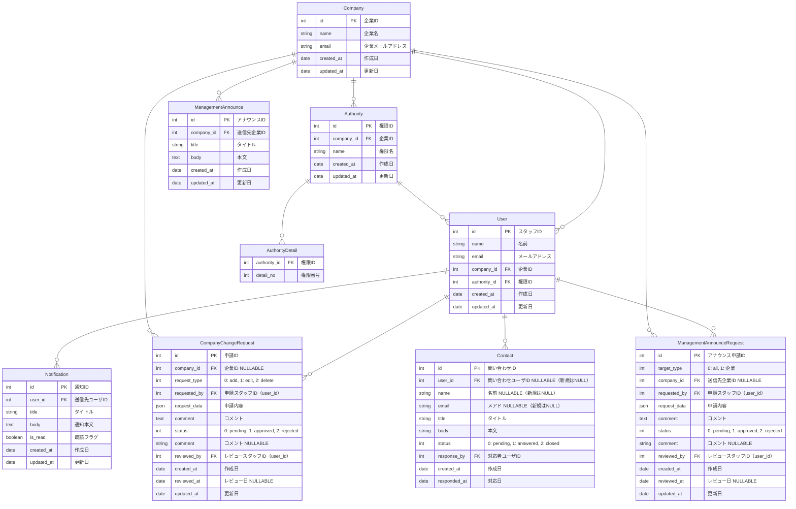

# このレポジトリ
シフト管理システムを作ってます。構想も同時並行で行っています
アジャイル開発&スキーマ駆動でやってます。勉強のため1から作ってます

# ER図

```mermaid
erDiagram
    User {
        int id PK "スタッフID"
        string name "名前"
        string email "メールアドレス"
        int company_id FK "企業ID"
        int authority_id FK "権限ID"
        date created_at "作成日"
        date updated_at "更新日"
    }
    Company {
        int id PK "企業ID"
        string name "企業名"
        string email "企業メールアドレス"
        date created_at "作成日"
        date updated_at "更新日"
    }
    Authority {
        int id PK "権限ID"
        int company_id FK "企業ID"
        string name "権限名"
        date created_at "作成日"
        date updated_at "更新日"
    }

    AuthorityDetail {
        int authority_id FK "権限ID"
        int detail_no "権限番号"
    }

    CompanyChangeRequest {
        int id PK "申請ID"
        int company_id FK "企業ID NULLABLE"
        int request_type "0: add, 1: edit, 2: delete"
        int requested_by FK "申請スタッフID（user_id）"
        json request_data "申請内容"
        text comment "コメント"
        int status "0: pending, 1: approved, 2: rejected"
        string comment "コメント NULLABLE"
        int reviewed_by FK "レビュースタッフID（user_id）"
        date created_at "作成日"
        date reviewed_at "レビュー日 NULLABLE"
        date updated_at "更新日"
    }

    Notification {
        int id PK "通知ID"
        int user_id FK "送信先ユーザID"
        string title "タイトル"
        text body "通知本文"
        boolean is_read "既読フラグ"
        date created_at "作成日"
        date updated_at "更新日"
    }

    ManagementAnnounceRequest {
        int id PK "アナウンス申請ID"
        int target_type "0: all, 1: 企業"
        int company_id FK "送信先企業ID NULLABLE"
        int requested_by FK "申請スタッフID（user_id）"
        json request_data "申請内容"
        text comment "コメント"
        int status "0: pending, 1: approved, 2: rejected"
        string comment "コメント NULLABLE"
        int reviewed_by FK "レビュースタッフID（user_id）"
        date created_at "作成日"
        date reviewed_at "レビュー日 NULLABLE"
        date updated_at "更新日"
    }

    ManagementAnnounce {
        int id PK "アナウンスID"
        int company_id FK "送信先企業ID"
        string title "タイトル"
        text body "本文"
        date created_at "作成日"
        date updated_at "更新日"
    }

    Contact {
        int id PK "問い合わせID"
        int user_id FK "問い合わせユーザID NULLABLE（新規はNULL）"
        string name "名前 NULLABLE（新規はNULL）"
        string email "メアド NULLABLE（新規はNULL）"
        string title "タイトル"
        string body "本文"
        int status "0: pending, 1: answered, 2: closed"
        int response_by FK "対応者ユーザID"
        date created_at "作成日"
        date responded_at "対応日"
    }

    Company ||--o{ User: ""
    Company ||--o{ Authority: ""
    Authority ||--o{ User: ""
    Authority ||--o{ AuthorityDetail: ""
    User ||--o{ Notification: ""
    User ||--o{ CompanyChangeRequest: ""
    Company ||--o{ CompanyChangeRequest: ""
    Company ||--o{ ManagementAnnounce: ""
    User ||--o{ ManagementAnnounceRequest: ""
    Company ||--o{ ManagementAnnounceRequest: ""
    User ||--o{ Contact: ""

```
